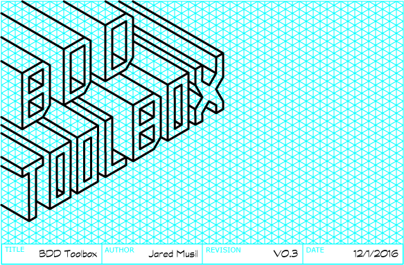

## Summary

This was my first attempt at creating a complex Python + Tkinter UI application. Needless to say looking back at it there is a lot I would change, but nonetheless it was a fun project to learn the Tkinter UI framework and genuinely did speed up running and managing local BDD test suites. Currently it's not at a working state as I shelfwared it when my team at the time got a dedicated Q/A engineer.

---

This program contains various convenience functions useful for BDD style test development. For example, the tags tab will scan a given folder for .story files and make a unique list of all the @tag TAG: annotations. This list is then used for requirements tracking for large projects. Additionally the metrics and tests tabs can be used to monitor release quality and quickly perform local tests.

**Features**
- Convenient navigation of project requirements.
- Lists all written stories, scenarios reguardless of underlying folder structure.
- BDD story editor with syntax highlighting.
- Metatag story browser. Aggregates commonly tagged stories into a list.
- Simplified local testing.

## Screenshots

## Links

* GitHub: https://github.com/jaredmusil/bdd-toolbox
