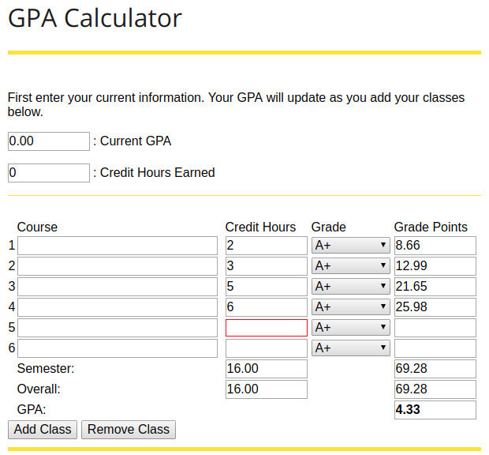

## Summary

I coded this up in college because at the time, the GPA calculator that was on the registrar's website would not let you input your existing GPA, and see how getting a good or bad grade would impact it in the following semester. It was simply a calculator for what your GPA would be _this_ semester, not your overall GPA. As someone who changed majors, I had built up more credits than my current degree program required so taking more classes made proportionally less of a + / - impact on my GPA. To keep on top of things, I wanted to see exactly how my remaining classes would help / harm my overall GPA. This calculator was created so that I could do that.

Note that at the University of Iowa, if you managed to get an A+, the + actually counted and it was possible to get a 4.33 GPA. So this calculator is specific to only schools and universities that utilize that grading scale. I thought that was odd, but hey I don't make the rules.

This bit of code from time to time I actually find out in the wild like [these copies on Code Pen](https://codepen.io/search/pens?q=jared+musil). It's fun knowing somebody random found your code useful!

## Screenshots

## Links

* Demo: https://gpa-calculator.netlify.app
* GitHub: https://github.com/jaredmusil/gpa-calculator
