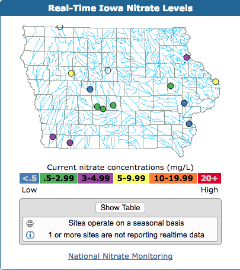

## Summary

An old project from my days at the USGS. One of the many roles that the USGS does is provide real-time water constituent data for scientists and businesses. In order to do this the river gage stations must be operational and uploading data. Part of the offices job was to physically go to river gage stations that were reporting bad data, and fix the equipment and or get data that was no longer being updated via satalite (flooding, ice, etc can cause this). This was usually done by looking at tables of groundwater data and looking for missing and / or bad data. Our office was approached by the individuals who make these updates with the request if they could have a simple graphic on the website to see at a glance what sites were operational. This graphic was then enhanced further to show what groundwater sites were _expected_ to be reporting bad data as they operated on a seasonal basis where winter data was discarded. This turned out to be popular as it saved time browsing through (admittently somewhat dated) [NWIS](https://waterdata.usgs.gov/nwis) data tables. Users also enjoyed being able to quickly pull up a specific site by clicking on the colored dot on the plot.

Eventually the success of this groundwater plot was duplicated into a new plot but this time tracking real time Nitrate data. Given Iowa's location as a agricultural state monitoring the impact of fertilizer runoff was of great interest and a number of the Scientists worked on the subject. I enjoyed that my little code contribution could help in this work.

On the technical side, origanally it was coded in PHP, but recently I switched it over to be JavaScript only. Im somewhat proud that 10+ years later, it still works while being almost untouched. The plotting itself is pretty rudimentary and involved getting lat/long coordinates, and transforming that into an x/y pixel location on a HTML canvas. Working on this project spurred my now long time interest in learning and mastering the R programming language to be able to better consume, transform, and plot interesting data like this.

## Screenshots

## Links

* Demo: https://ia-maps.netlify.app
* GitHub: https://github.com/jaredmusil/ia-maps