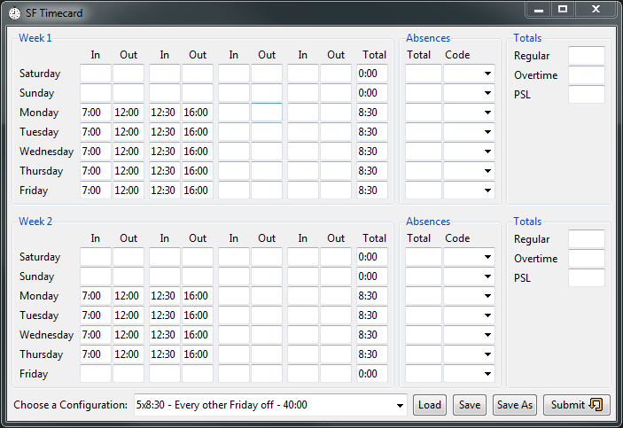

## Summary

This app was created long ago to simplify entering a timecard into a ancient legacy enterprise timecard webapp. It lacked the ability to pre-populate a work schedule, or copy the schedule from the previous week. Needless to say it was tedius to enter every week. This program is long since replaced at the company it was used at, but when it was relevant, it was a real timesaver.

This was the program after the BDD toolbox where in general my Tkinter UI skills were a bit better. Its pretty overkill for the task at hand, but I enjoyed the challenge. It was also fun to see other people use it internally at the company. Its currently shelfware but still serves some purpouse as a reference app thats not too complex to understand Python + Tkinter UI development.

## Screenshots

## Links

* GitHub: https://github.com/jaredmusil/timecard
